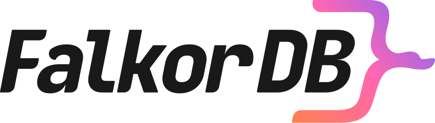
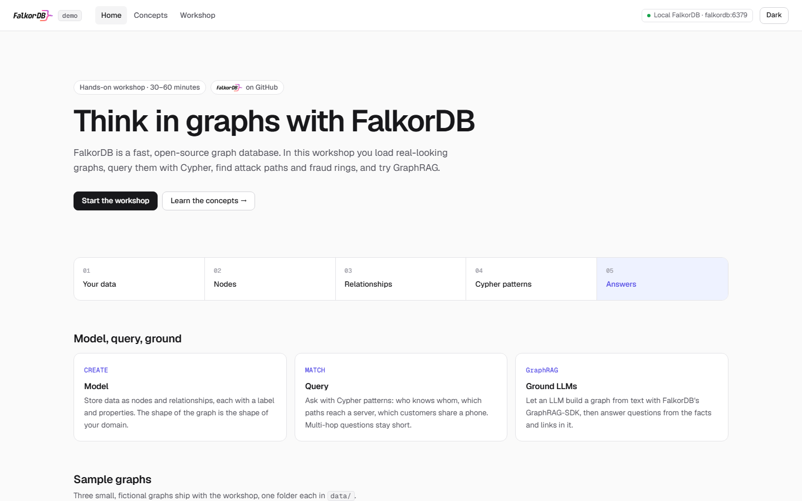
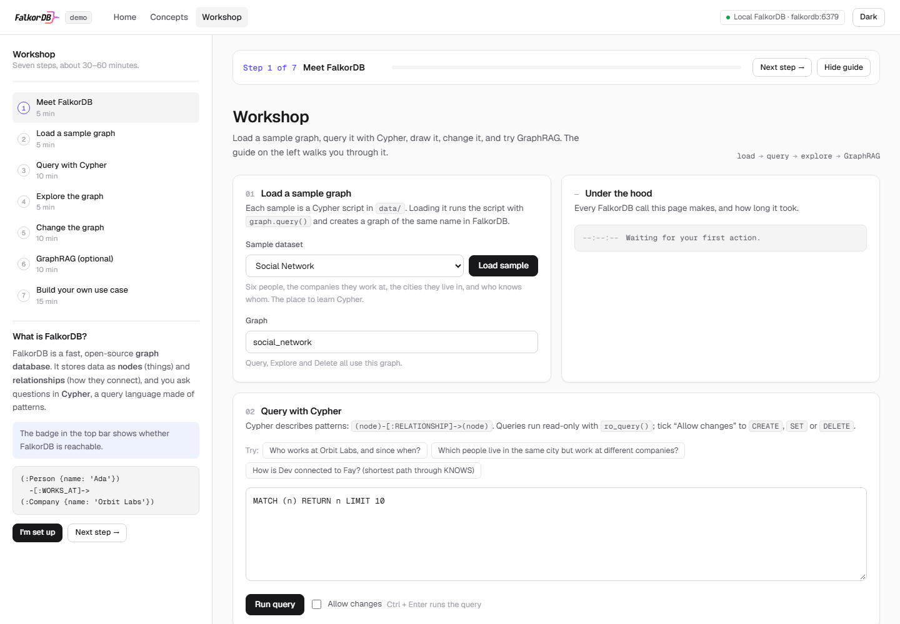
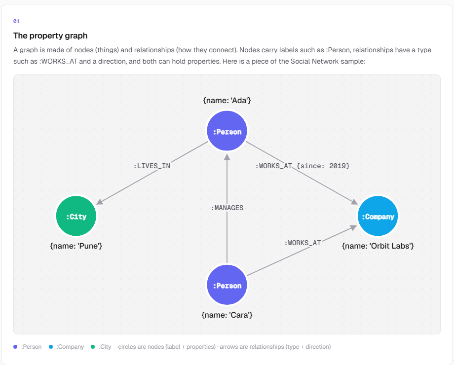

<div align="center">
  <a href="https://github.com/FalkorDB/FalkorDB">
    
  </a>
</div>

<h1 align="center">falkordb-demo</h1>

<p align="center">
  A hands-on workshop for <a href="https://www.falkordb.com/">FalkorDB</a>, the fast, open-source
  graph database.
</p>

<p align="center">
  
</p>

Load real-looking graphs, query them with Cypher, find an attack path and a fraud ring, let an LLM
build a graph with GraphRAG, then model your own data and open a pull request.

- **One command to run**, no account and no API key for the core workshop
- **30–60 minutes**, for beginners and developers
- **A real app**: FastAPI backend, React + TypeScript frontend with Home, Concepts and Workshop pages

```text
your data  →  nodes + relationships  →  Cypher patterns  →  answers  (+ GraphRAG with an LLM)
```

## Get started

You need **[Docker Desktop](https://docs.docker.com/get-docker/)** and **[Git](https://git-scm.com/downloads)**.

```bash
git clone https://github.com/jars-demo/falkordb-demo.git
cd falkordb-demo
docker compose up -d --build
```

Open **<http://localhost:3200/#/workshop>** and follow the steps on the left. FalkorDB's own
browser UI runs at <http://localhost:3201>.

**Want GraphRAG, FalkorDB Cloud, or to develop locally?** Run the guided setup:

```bash
python scripts/setup.py
```

## A look inside

| Workshop: guide + live playground | Concepts: the property graph |
|---|---|
|  |  |

## The workshop

| Step | You will | Time |
|---|---|---|
| [00 · Prerequisites](workshop/00-prerequisites.md) | Install and start the app | before |
| [01 · Meet FalkorDB](workshop/01-meet-falkordb.md) | Learn nodes, relationships and Cypher | 5 min |
| [02 · Load a sample](workshop/02-load-a-sample.md) | Create your first graph | 5 min |
| [03 · Query with Cypher](workshop/03-query.md) | MATCH, WHERE, RETURN, paths | 10 min |
| [04 · Explore the graph](workshop/04-explore.md) | See the shape of the data | 5 min |
| [05 · Change the graph](workshop/05-change-the-graph.md) | CREATE, MERGE, SET, indexes | 10 min |
| [06 · GraphRAG](workshop/06-graphrag.md) | Let an LLM build a graph (optional, free Groq key) | 10 min |
| [07 · Your use case](workshop/07-your-use-case.md) | Model your own data and open a PR | 15 min |

The app has three pages: **Home**, **Concepts** (the ideas, with examples) and **Workshop** (these
steps, next to a live playground). Stuck? See [troubleshooting](workshop/troubleshooting.md).

## Sample graphs

| Folder / graph | What it is | Try asking |
|---|---|---|
| [`social_network`](data/social_network) | Six people, two companies, two cities | How is Dev connected to Fay? |
| [`cyber_attack_paths`](data/cyber_attack_paths) | Hosts, open ports, vulnerabilities, accounts | What is the shortest path from the internet to the customer database? |
| [`fraud_ring`](data/fraud_ring) | Customers who share a phone, a device and an address | Is there a circle of money transfers? |

All fictional. Each folder has a `seed.cypher` and an `about.json` with questions and their Cypher.

## How to run it

| Option | You need | Where FalkorDB runs |
|---|---|---|
| **1 · Docker** (default) | Docker | In the `falkordb` container, next to the app |
| **2 · Develop** | Docker, Python 3.10–3.13 ([uv](https://docs.astral.sh/uv/) recommended), Node 22.12+, a C++ compiler ([why](workshop/troubleshooting.md)) | In Docker; backend and frontend run locally with hot reload |
| **3 · FalkorDB Cloud** | A [FalkorDB Cloud](https://app.falkordb.cloud) instance, Python, Node | In the cloud |

| URL | What |
|---|---|
| <http://localhost:3200> | The app |
| <http://localhost:8200/docs> | Backend API (Swagger) |
| <http://localhost:3201> | FalkorDB browser UI |
| `localhost:6379` | FalkorDB (Redis protocol) |

The ports differ from [cognee-demo](https://github.com/jars-demo/cognee-demo)'s, so both
workshops can run side by side.

## What is inside

```text
falkordb-demo/
├── docker-compose.yml      the stack: FalkorDB + backend + frontend
├── .env.example            every setting, explained (setup.py writes .env)
├── app/
│   ├── backend/            FastAPI · start with services/graph.py
│   └── frontend/           React + TypeScript + Vite · start with src/pages/
├── data/                   3 sample graphs (+ the GraphRAG sample text)
├── usecases/               attendee use cases · copy _template/
├── workshop/               the step-by-step guide
├── scripts/                setup.py (guided setup) · check_setup.py (end-to-end check)
└── tests/                  backend tests
```

## For developers

Keep FalkorDB in Docker and run the code locally with hot reload:

```bash
docker compose up -d falkordb                       # or: docker compose stop frontend backend
uv sync && uv run python -m app --reload            # backend  → http://localhost:8200
cd app/frontend && npm install && npm run dev       # frontend → http://localhost:5273
```

Without uv: `python -m venv .venv`, then `.venv/bin/pip install -r requirements.txt` and
`.venv/bin/python -m app --reload` (Windows: `.venv\Scripts\...`).

Every FalkorDB call lives in [`app/backend/services/graph.py`](app/backend/services/graph.py):

| Endpoint | FalkorDB call |
|---|---|
| `POST /api/samples/{name}/load` | `select_graph(name).query(seed)` |
| `POST /api/query` | `ro_query(cypher)`, or `query(cypher)` with `allow_writes` |
| `GET /api/graphs/{name}/view` | `ro_query("MATCH (n) …")` |
| `DELETE /api/graphs/{name}` | `select_graph(name).delete()` |
| `POST /api/graphrag/ingest`, `/ask` | GraphRAG-SDK `ingest()` and `completion()` |

Checks, as CI runs them:

```bash
uv run pytest && uv run ruff check . && uv run ruff format --check .
cd app/frontend && npm run lint && npm run build
```

Versions are pinned everywhere: `pyproject.toml` + `uv.lock` (and the full `requirements.txt`
for pip), `app/frontend/package.json` + `package-lock.json`, and `falkordb/falkordb:6.0.1`.

## Publish the landing site (Vercel)

Vercel can host the **frontend only**. The static build (`npm run build:static`) keeps Home and
Concepts and turns the Workshop page into "run it locally" instructions;
[`app/frontend/vercel.json`](app/frontend/vercel.json) is set up for it.

1. In Vercel, **Add New → Project** and import this repository.
2. Set **Root Directory** to `app/frontend` and keep the other settings.
3. Click **Deploy**. No environment variables are needed.

## Contribute

Add your use case (the workshop's final step) or improve the workshop: see
[CONTRIBUTING.md](CONTRIBUTING.md).

## Learn more about FalkorDB

[Website](https://www.falkordb.com/) · [Docs](https://docs.falkordb.com/) ·
[GitHub](https://github.com/FalkorDB/FalkorDB) · [GraphRAG-SDK](https://github.com/FalkorDB/GraphRAG-SDK) ·
[QueryWeaver](https://github.com/FalkorDB/QueryWeaver) · [Blog](https://www.falkordb.com/blog/)

This is a community workshop built on FalkorDB, not an official FalkorDB project.
